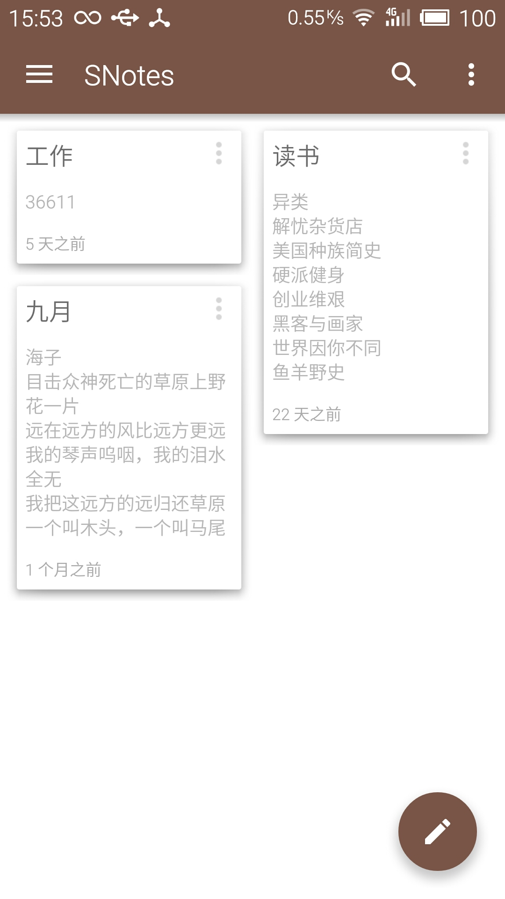
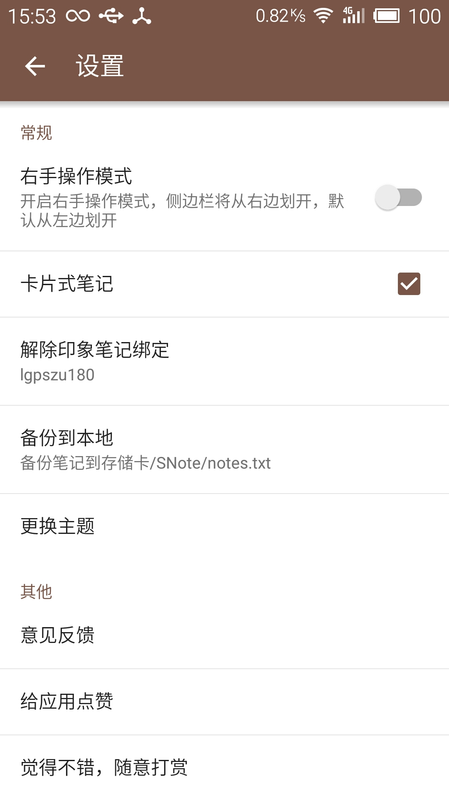
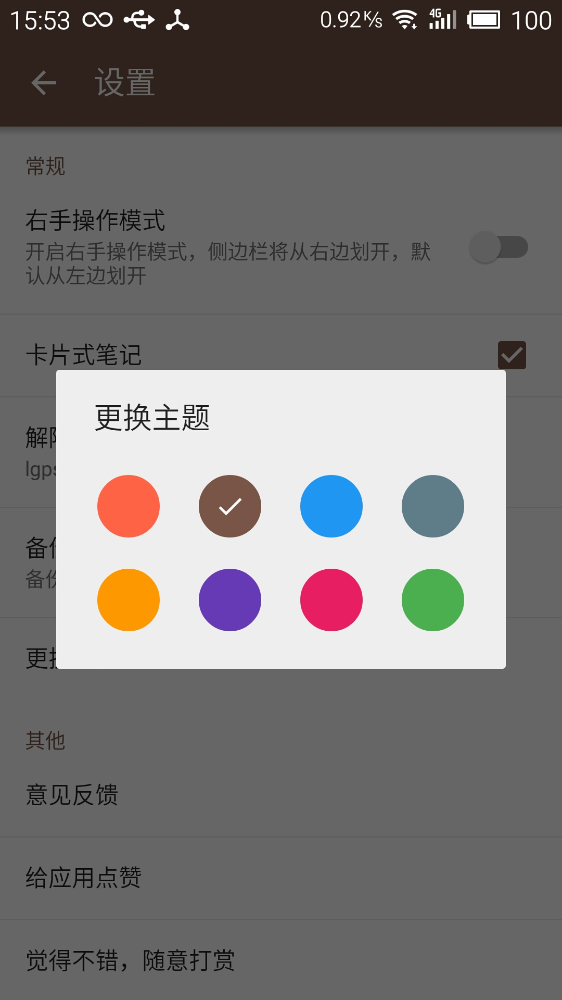
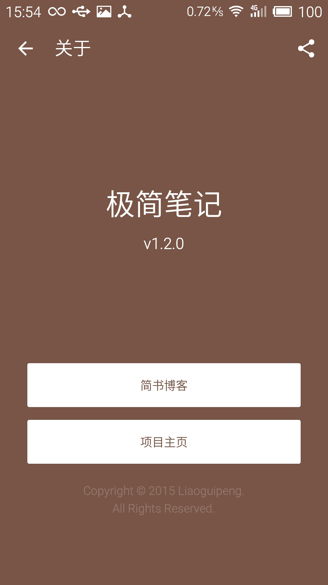
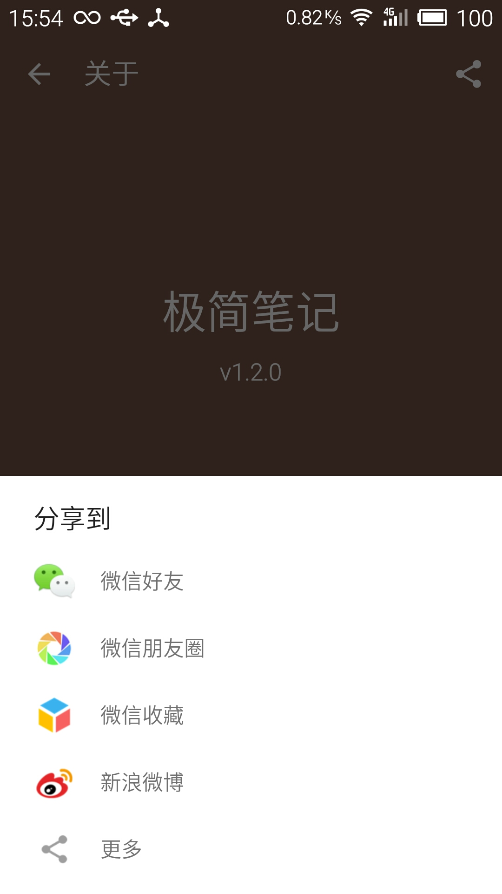
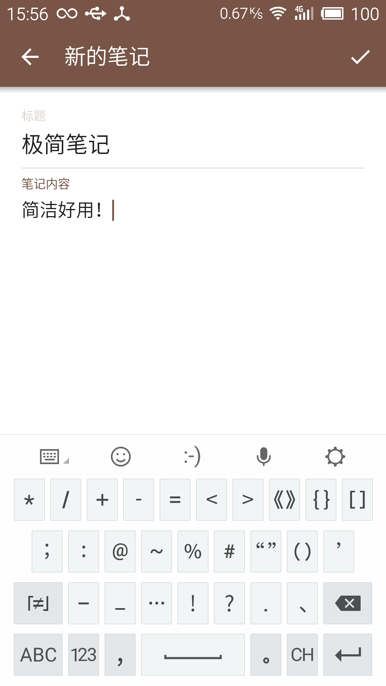

#ScreenShot










###感谢我的好朋友为我设计应用 logo，他所在的设计团队是来自中大的火鸡设计室，你可以通过 liaojlin@outlook.com 与他取得联系
###欢迎加入热心网友建的学习交流群：461259695

#1.2.0
- 将同步的方式改为绑定印象笔记
- 增加备份到本地的功能
- 对APP进行瘦身，安装包仅为1.57M
- 修改分享页面从底部弹出
- 修复Snackbar弹出时会挡住FloatButton的问题
- 修复一些bug

#1.1.2
- 增加了多款彩色主题的选择
- 增加了关于界面的分享功能
- 修复了笔记过长的显示问题
- 修复了SwipeRefreshLayout和RecyclerView的组合问题
- 优化界面的一些细节，修复已知的小bug

#1.1.0
- 增加了笔记列表的卡片式的布局，可在设置里面切换
- 增加了下拉同步笔记的组件
- 增加编辑笔记时点击返回询问是否保存
- 使用了Snackbar代替了Toast的提示
- 去除了编辑笔记内容的下划线
- 修改了笔记列表的显示时间方式
- 修复了小米2s 5.0上CardView的显示问题

#1.0.2
- Material Design风格，采用抽屉式菜单，悬浮滑动按钮，点击控件时的水波纹效果，状态栏透明使得与应用融为一体，用户即使在Android L系统以下的手机也能感受到良好的用户体验
- 用文字记录身边随时发生的事情，或者你的待办事项
- 同步，同步需要你在手机设置里面添加一个邮箱，并作为你的同步账号，提交到服务器

#关于我
- 一个刚步入社会的毕业僧
- Email: lgpszu@163.com

#License
```
Copyright 2015 Liaoguipeng

Licensed under the Apache License, Version 2.0 (the "License");
you may not use this file except in compliance with the License.
You may obtain a copy of the License at

    http://www.apache.org/licenses/LICENSE-2.0

Unless required by applicable law or agreed to in writing, software
distributed under the License is distributed on an "AS IS" BASIS,
WITHOUT WARRANTIES OR CONDITIONS OF ANY KIND, either express or implied.
See the License for the specific language governing permissions and
limitations under the License.
```
