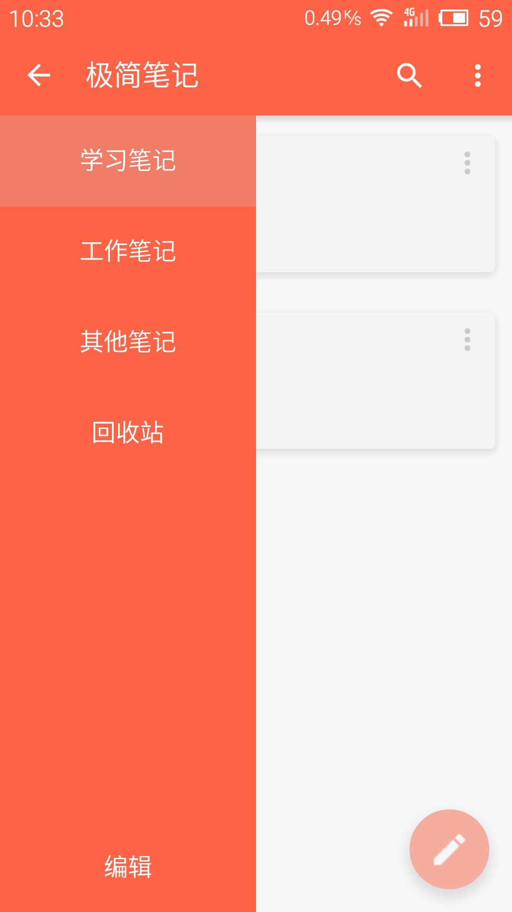
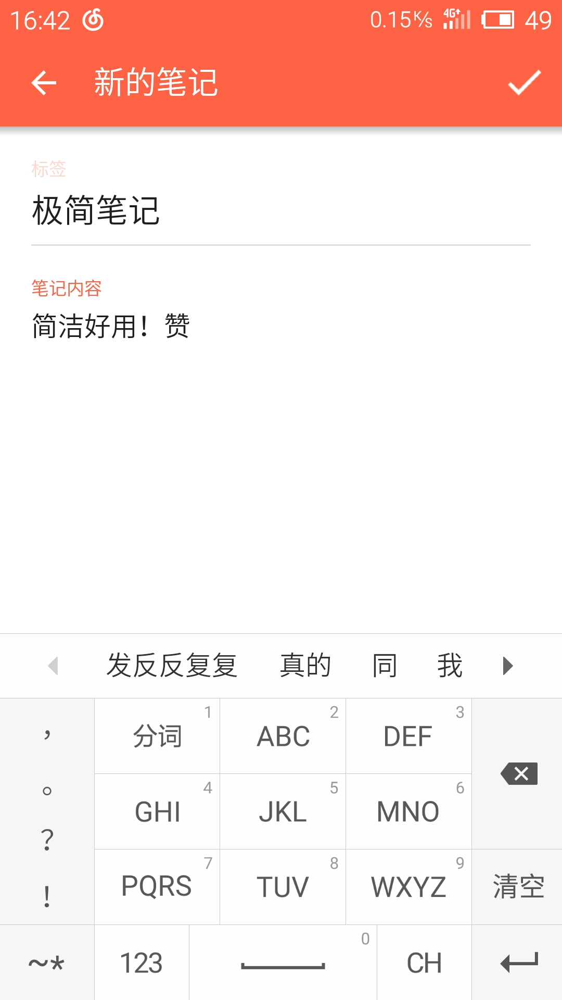
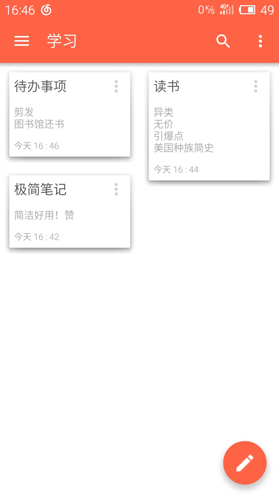
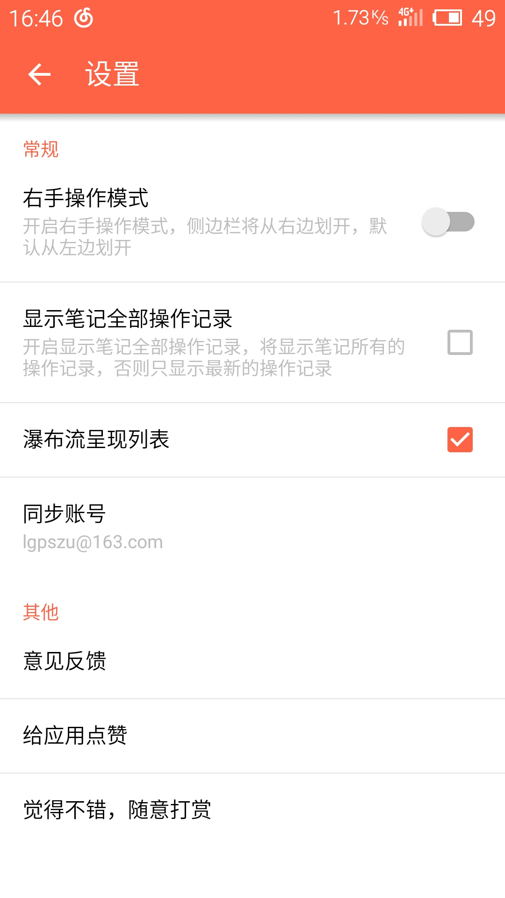
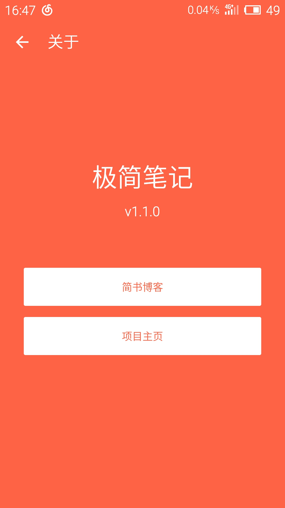

#ScreenShot

#1.1.0
- 增加了笔记列表的卡片式的布局，可在设置里面切换
- 增加了下拉同步笔记的组件
- 增加编辑笔记时点击返回询问是否保存
- 使用了Snackbar代替了Toast的提示
- 去除了编辑笔记内容的下划线
- 修改了笔记列表的显示时间方式
- 修复了小米2s 5.0上CardView的显示问题

#1.0.2
- Material Design风格，采用抽屉式菜单，悬浮滑动按钮，点击控件时的水波纹效果，状态栏透明使得与应用融为一体，用户即使在Android L系统以下的手机也能感受到良好的用户体验
- 用文字记录身边随时发生的事情，或者你的待办事项
- 同步，同步需要你在手机设置里面添加一个邮箱，并作为你的同步账号，提交到服务器